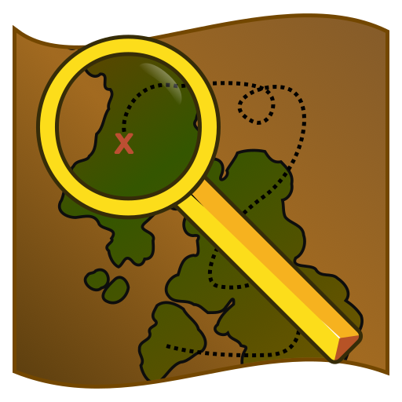
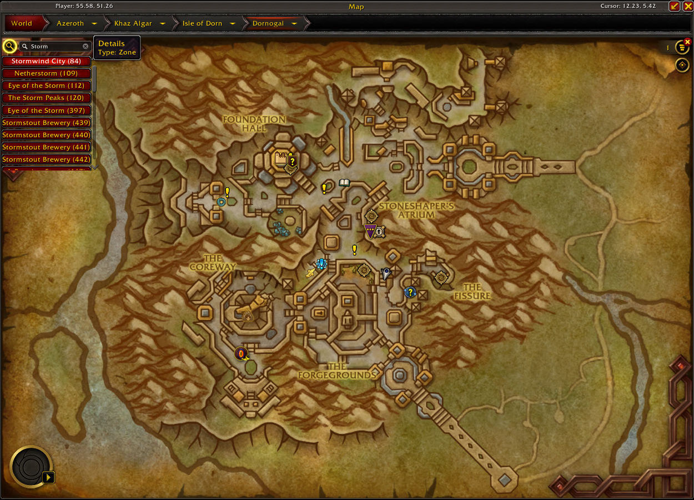
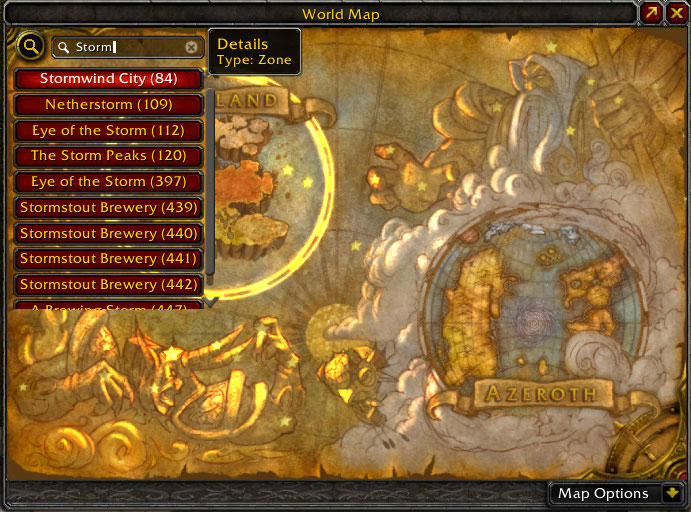
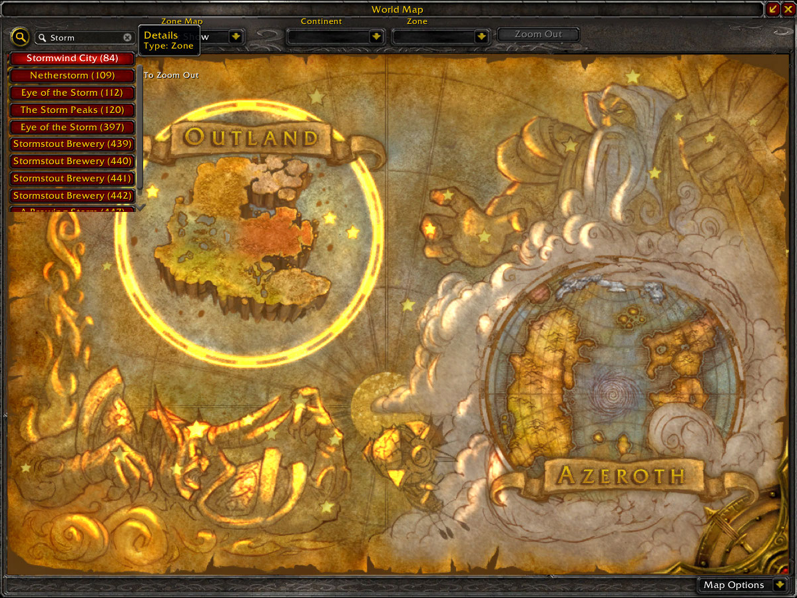
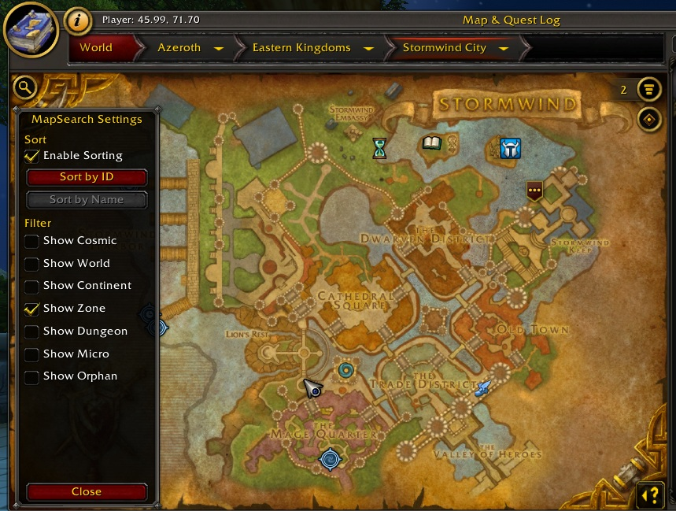

# MapSearch

A small addon for World of Warcraft that adds a search bar to the World Map Frame.

> Supports Classic and Retail!

Allows for maps to be searched for by name or ID.

### The World Map Frame in Retail

### The expanded World Map Frame in Retail

### The World Map Frame in Classic

### The expanded World Map Frame in Classic

## Updates
### 0.2.0
Added the ability to sort and filter the search results!

## Get it
MapSearch is available for download on CurseForge!

<a href="https://www.curseforge.com/wow/addons/mapsearch">.svg?badge_style=for_the_badge)</a>